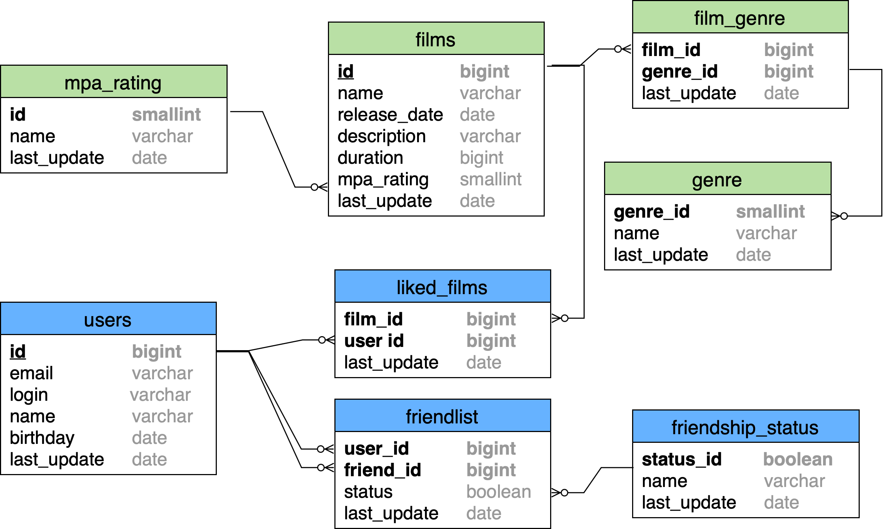

# FilmRate
Web-Service for movies and TV-shows access

## Database diagram

### SQL requests examples
**Get all films**

    SELECT *
    FROM films;
    
**Get all users**

    SELECT *
    FROM users;
    
**Get top 10 films**

    SELECT f.name, COUNT(lf.film_id) AS likes_count
    FROM films AS f
    LEFT JOIN liked_films as lf ON lf.film_id=films.film_id
    ORDER BY likes_count DESC
    LIMIT 10;

**Get friend list**

    SELECT friend_id
    FROM friendlist
    WHERE user_id = 0000    // User's ID should be instead of 0000
          AND status = 1;
    
